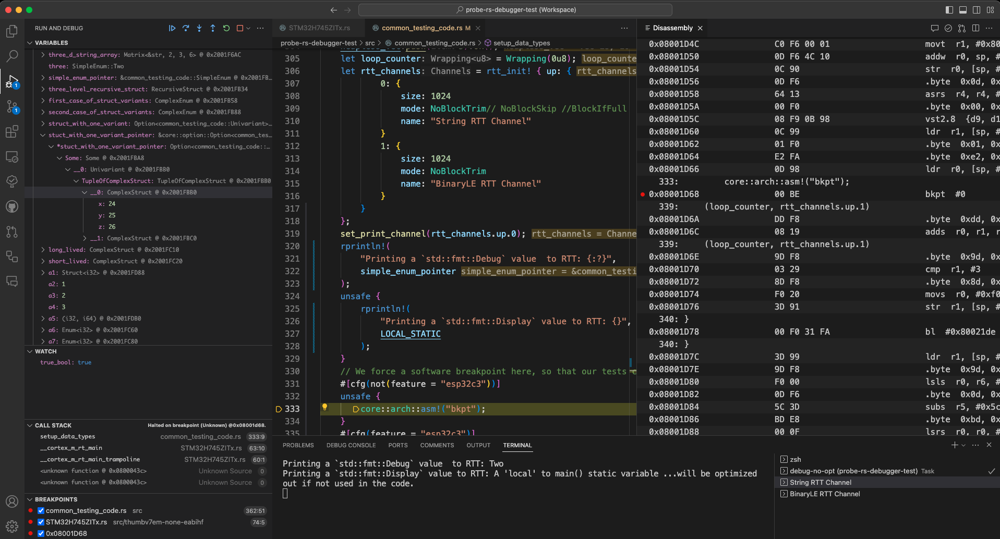

import { SITE_TITLE, SITE_DESCRIPTION } from "../consts";
import FormattedDate from "../components/FormattedDate.astro";
import { posts } from "../utils";

import banner from '../images/banner.svg';

{
<div class="notprose md:flex gap-5 md:w-xl mx-auto py-20">
  <h1 class="text-5xl font-bold text-left">
    <span>The </span><br />
    <span class="text-green">user-friendly</span> &<br/>
    <span class="text-green">flexible</span> embedded toolkit<br />
    <span class="text-green">that works</span>
  </h1>
  <Image src={banner} alt="probe-rs logo" class="mx-auto" />
</div>
}

Run the following, or follow the
<a
  href={import.meta.env.BASE_URL + "/docs/getting-started/installation"}
  class="text-[#15846f] underline">instructions</a>
for different installation methods:

```sh wrap
curl --proto '=https' --tlsv1.2 -LsSf https://github.com/probe-rs/probe-rs/releases/latest/download/probe-rs-tools-installer.sh | sh
```

## Embedded programming made easy

Run a program on your microchip with the ease of a native application.

Easily print to STDOUT via RTT and defmt encoding when using probe-rs run.

`cargo-flash` can be used to just flash a target and cargo-embed can be used
to get a full RTT terminal to also send commands to the target and view
multiple channels at one.

<div class="flex gap-2 justify-center">
  <p>
    <a href="https://crates.io/crates/probe-rs" target="_blank"
      ></a
    >
  </p><p>
    <a href="https://docs.rs/probe-rs" target="_blank"
      ></a
    >
  </p><p>
    <a href="https://github.com/probe-rs/probe-rs/actions" target="_blank"
      ></a
    >
  </p><p>
    <a href="https://matrix.to/#/#probe-rs:matrix.org" target="_blank"
      ></a
    >
  </p>
</div>

## Run a program on your microchip with the ease of a native application.

Easily print to STDOUT via <a href="https://github.com/probe-rs/rtt-target">RTT</a> and <a href="https://github.com/knurling-rs/defmt">defmt</a> encoding when using `probe-rs run`.

<a href="/docs/tools/cargo-flash/">cargo-flash</a> can be used to just flash a target and <a href="/docs/tools/cargo-embed/">cargo-embed</a>
can be used to get a full RTT terminal to also send commands to the target and view multiple channels
at one.

<details class="pl-5 text-2xl my-3">
  <summary>Rust: `$ cargo run --release`</summary>

  ```shell title="Rust"
  $ cargo run --release
    Compiling microbit v0.1.0 (/microbit/)
      Finished release [optimized + debuginfo] target(s) in 0.17s
      Running `probe-rs run --chip nRF51822_xxAA target/thumbv6m-none-eabi/release/microbit`
      Erasing sectors ✔ [00:00:00] [############] 5.00 KiB/5.00 KiB @ 8.09 KiB/s (eta 0s )
  Programming pages   ✔ [00:00:00] [############] 5.00 KiB/5.00 KiB @ 5.29 KiB/s (eta 0s )

  Hello from the microbit!
  Going to udf to print a stacktrace on the host ...

  Frame 0: exp_u128 @ 0x00000fa2
  Frame 1: __udf @ 0x000000f2 inline
        /.cargo/registry/src/index.crates.io-6f17d22bba15001f/cortex-m-0.7.7/src/../asm/inline.rs:181:5
  Frame 2: udf @ 0x00000000000000f2 inline
        /.cargo/registry/src/index.crates.io-6f17d22bba15001f/cortex-m-0.7.7/src/call_asm.rs:11:43
  Frame 3: panic @ 0x00000000000000f2
        /repos/microbit/examples/gpio-hal-blinky/src/main.rs:36:9
  Frame 4: exp_u128 @ 0x000006be
        /rustc/5680fa18feaa87f3ff04063800aec256c3d4b4be/library/core/src/ptr/const_ptr.rs:921:18
  Frame 5: exp_u128 @ 0x000006ec
        /rustc/5680fa18feaa87f3ff04063800aec256c3d4b4be/library/core/src/num/bignum.rs:299:60
  Frame 6: b @ 0x0000015e inline
        /repos/microbit/examples/gpio-hal-blinky/src/main.rs:45:5
  Frame 7: a @ 0x0000000000000154 inline
        /repos/microbit/examples/gpio-hal-blinky/src/main.rs:41:5
  Frame 8: __cortex_m_rt_main @ 0x0000000000000154
        /repos/microbit/examples/gpio-hal-blinky/src/main.rs:16:5
  Frame 9: __cortex_m_rt_main_trampoline @ 0x00000104
        /repos/microbit/examples/gpio-hal-blinky/src/main.rs:10:1
  Frame 10: <unknown function @ 0x000000ce> @ 0x000000ce inline
  Frame 11: <unknown function @ 0x20004000> @ 0x20004000
  ```
</details>

<details class="pl-5 text-2xl my-3">
  <summary>C: `$ make release && probe-rs run`</summary>

  ```shell title="C"
  $ make release
  $ probe-rs run --chip nRF51822_xxAA build/microbit.elf
      Erasing sectors ✔ [00:00:00] [############] 5.00 KiB/5.00 KiB @ 8.09 KiB/s (eta 0s )
  Programming pages   ✔ [00:00:00] [############] 5.00 KiB/5.00 KiB @ 5.29 KiB/s (eta 0s )

  Hello from the microbit!
  Going to udf to print a stacktrace on the host ...

  Frame 0: exp_u128 @ 0x00000fa2
  Frame 1: __udf @ 0x000000f2 inline
        /.cargo/registry/src/index.crates.io-6f17d22bba15001f/cortex-m-0.7.7/src/../asm/inline.rs:181:5
  Frame 2: udf @ 0x00000000000000f2 inline
        /.cargo/registry/src/index.crates.io-6f17d22bba15001f/cortex-m-0.7.7/src/call_asm.rs:11:43
  Frame 3: panic @ 0x00000000000000f2
        /repos/microbit/examples/gpio-hal-blinky/src/main.rs:36:9
  Frame 4: exp_u128 @ 0x000006be
        /rustc/5680fa18feaa87f3ff04063800aec256c3d4b4be/library/core/src/ptr/const_ptr.rs:921:18
  Frame 5: exp_u128 @ 0x000006ec
        /rustc/5680fa18feaa87f3ff04063800aec256c3d4b4be/library/core/src/num/bignum.rs:299:60
  Frame 6: b @ 0x0000015e inline
        /repos/microbit/examples/gpio-hal-blinky/src/main.rs:45:5
  Frame 7: a @ 0x0000000000000154 inline
        /repos/microbit/examples/gpio-hal-blinky/src/main.rs:41:5
  Frame 8: __cortex_m_rt_main @ 0x0000000000000154
        /repos/microbit/examples/gpio-hal-blinky/src/main.rs:16:5
  Frame 9: __cortex_m_rt_main_trampoline @ 0x00000104
        /repos/microbit/examples/gpio-hal-blinky/src/main.rs:10:1
  Frame 10: <unknown function @ 0x000000ce> @ 0x000000ce inline
  Frame 11: <unknown function @ 0x20004000> @ 0x20004000
  ```
</details>

## Easy debugging in VSCode

Use <a href="/docs/tools/debugger/">VSCode's</a> awesome debug capabilities with our native debug plugin.

Run the target, set breakpoints, halt on break point, inspect the stackframe and manipulate variables.

<a href="https://github.com/probe-rs/rtt-target">RTT</a> is fully integrated and GDB-like expressions can be evaluated in the built in <a href="/docs/tools/debugger/">REPL</a>.

VSCode not your cup of tea? No problem! probe-rs implements the [Debug Adapter Protocol](https://microsoft.github.io/debug-adapter-protocol/overview), so you can use other [editors, IDEs, and visual debuggers](https://microsoft.github.io/debug-adapter-protocol/implementors/tools/), such as [Vimspector](https://github.com/puremourning/vimspector#readme)...



## A clean and intuitive API

Manipulate your target from the host - read and write memory, set breakpoints, run, halt.

Build production utilities or awesome HITL setups. The sky is the limit!

```rust { title="main.rs" }
use probe_rs::{MemoryInterface, Permissions, Session};

// Attach to the first connected probe.
let session = Session::auto_attach("nrf52", Permissions::default())?;

// Select the first core found.
let mut core = session.core(0);

// Read a block of 50 32 bit words.
let mut data = [0u32;50];
core.read_32(0x2000_0000, &mut data)?;

// Read a single 32 bit word.
let word = core.read_word_32(0x2000_0000)?;

// Writing is just as simple.
let data = [0u32;50];
core.write_32(0x2000_0000, &data)?;

// of course we can also write 8bit words.
let data = [0u8;50];
core.write_8(0x2000_0000, &data)?;
```

# Every ARM or RISC-V target

Hundreds of targets are shipped with probe-rs. You found a missing one?

<a href="/docs/knowledge-base/cmsis-packs/#target-extraction">Generate</a> your own target description from an existing CMSIS-Pack in 2 minutes.

No CMSIS-Pack? <a href="https://github.com/probe-rs/flash-algorithm-template">Write your own flash algorithm</a> in 2 hours with the help of our templates with automatic tests.

import { Image } from 'astro:assets';
import arm from '../images/landing/manufacturers/arm.webp';
import st from '../images/landing/manufacturers/st.png';
import nxp from '../images/landing/manufacturers/nxp.svg';
import espressif from '../images/landing/manufacturers/espressif.svg';
import raspberrypi from '../images/landing/manufacturers/raspberrypi.png';
import riscv from '../images/landing/manufacturers/risc-v.png';
import nordic from '../images/landing/manufacturers/nordic3.svg';

<div class="flex gap-5 justify-center flex-wrap">
  <Image src={arm} alt='arm' height="30" />
  <Image src={espressif} alt='espressif' height="30" />
  <Image src={nordic} alt='nordic' height="30" />
  <Image src={nxp} alt='nxp' height="30" />
  <Image src={raspberrypi} alt='raspberrypi' height="30" />
  <Image src={riscv} alt='risc-v' height="30" />
  <Image src={st} alt='st' height="30" />
</div>

# Supports many debug probes

Debug targets via CMSIS-DAP, JLink, ST-Link and FTDI or add your own probe easily.

We even have our own open-source probe to <a href="https://github.com/probe-rs/rusty-probe">build</a> or <a href="#" disabled>buy</a> (coming soon)

import cmsis from '../images/landing/probes/cmsis-dap.webp';
import jlink from '../images/landing/probes/jlink.svg';
import stlink from '../images/landing/probes/stlink.png';
import ftdi from '../images/landing/probes/ftdi.png';

<div class="flex gap-5 justify-center">
  <Image src={cmsis} alt='cmsis' height="30" />
  <Image src={jlink} alt='jlink' height="30" />
  <Image src={stlink} alt='stlink' height="30" />
  <Image src={ftdi} alt='ftdi' height="30" />
</div>

# How to contribute

Star the [repo on GitHub](https://github.com/probe-rs/probe-rs).

Support this project by [sponsoring it](https://github.com/sponsors/probe-rs).

Fork the repo and [contribute](https://github.com/probe-rs/probe-rs) fixing bugs, adding docs or tackling new features.

Help to [improve the docs](https://docs.rs/probe-rs).

Get help and discuss [on Matrix](https://matrix.to/#/#probe-rs:matrix.org).
